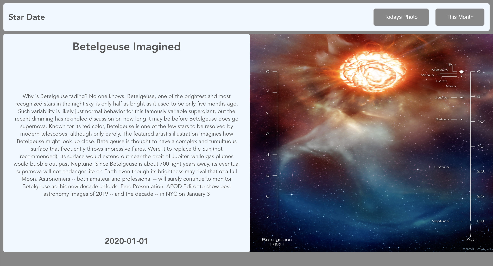
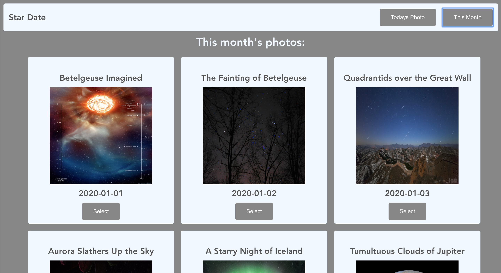

# Star Date: Visualizing the NASA APOD API

## Live site
You can visit the live site [here](https://star-date.herokuapp.com/)

---
## Summary
  This project was built as a 48 hour tech challenge using, Vue; a new framework for me at the time. User's can see the current month's photos from the NASA APOD API (updated every day). The user starts on the current day's photo and can then see all the photos for the month and select one of them for a more detailed view.

--- 

## Project setup (locally)
### Clone down the repo, cd into the directory and run:
```
npm install
```

### Compiles and hot-reloads for development
```
npm run serve
```

### Compiles and minifies for production
```
npm run build
```

### Customize configuration
See [Configuration Reference](https://cli.vuejs.org/config/).

## Technologies
This application was built using:
* [Vue](https://vuejs.org/v2/guide/)
* [The NASA APOD API](https://github.com/nasa/apod-api)
* [Heroku](https://heroku.com)

## Screenshots
 <details>
  <summary>Screenshots</summary>

  
  
</details>
